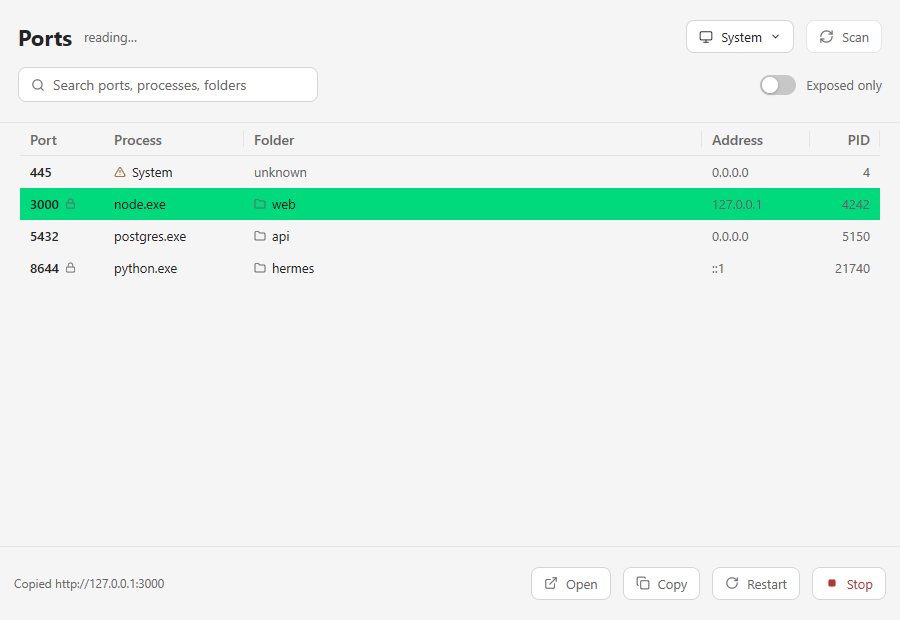
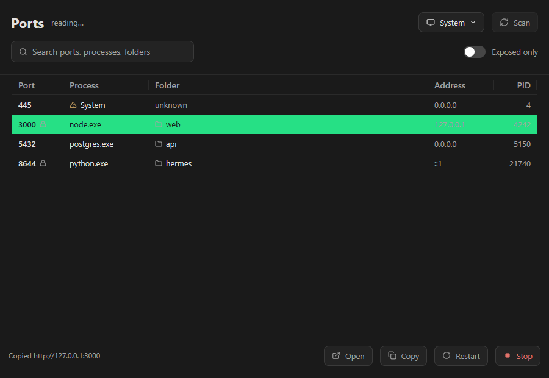
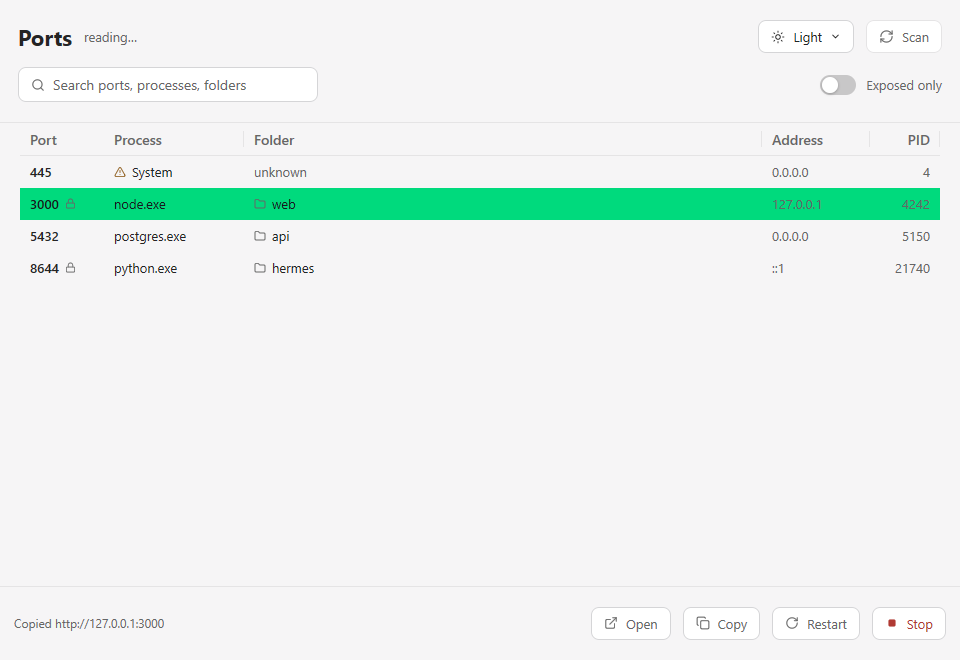
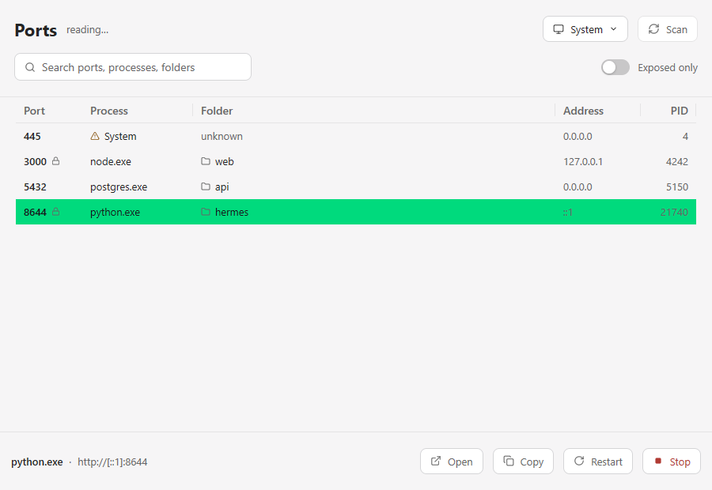

# Ports

A small native Windows app that shows every listening TCP port, the process
that owns it, and the folder it runs in — then lets you open, copy, restart or
stop it without touching a terminal.

Built with [MyGo](https://github.com/egoist/mygo) (`github.com/egoist/mygo v0.3.5`).





## What it does

- **Lists every listening port** (IPv4 and IPv6) with its owning process, PID
  and working directory, read from `GetExtendedTcpTable` rather than parsed
  `netstat` output — so it is not affected by system language.
- **Rescans every 2 seconds** on a background goroutine, so the window stays
  responsive and the list stays fresh. Press `R` to scan on demand.
- **Filters and sorts**: search by port, process, address or folder; click a
  column header to sort; the folder column takes the remaining width.
- **Exposed only** toggle hides loopback-only ports, so you can see what
  another machine can reach.
- **Actions per port**: Open (browser), Copy (URL), Restart (relaunch with the
  same command line and folder), Stop. Stopping and restarting ask for
  confirmation, and system processes (PID ≤ 4) are disabled with a reason.
- **Appearance menu**: the button opens a menu offering System, Light and Dark
  directly — no cycling, no double-click. The choice is remembered between runs.
- **Runs in the tray**: closing the window hides it; the scan loop, the chosen
  row and the scroll position survive. Quit from the tray menu.

## Screenshots

| Light | Dark |
|---|---|
|  |  |

A chosen system process — Stop and Restart are disabled:



## Install

Grab the installer or the standalone executable from
[Releases](../../releases), or build it yourself:

```sh
go tool mygo build      # produces build/windows-amd64/ports.exe
```

## Develop

```sh
go test ./...            # unit, view and render tests
go tool mygo vet .       # MyGo lifetime and goroutine checks
```

The render tests write PNGs of the window into `testdata/`, so an interface
change can be looked at without launching the app.

## Layout

| File | Responsibility |
|---|---|
| `main.go` | App startup, window options |
| `app.go` | Window state, scan loop, appearance resolution |
| `scan.go` / `scan_windows.go` | Read listening ports and their owners |
| `process_windows.go` / `process_control_windows.go` | Process names, folders, stop/relaunch |
| `cmdline.go` | Windows command-line splitting for restart |
| `view_header.go` / `view_table.go` / `view_footer.go` | The three regions of the window |
| `actions.go` | Open, copy, stop, restart and their confirmations |
| `appearance.go` / `theme.go` / `palette.go` | Appearance state and the brand theme |
| `settings.go` | Persisted appearance |
| `tray.go` / `trayicon.go` | Notification-area icon and menu |
| `icons.go` | SVG icons |

## License

MIT
