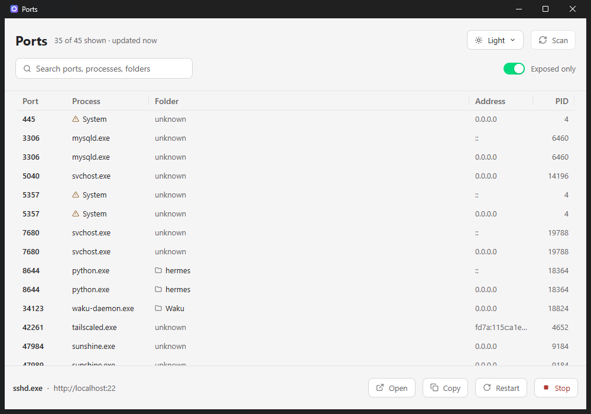
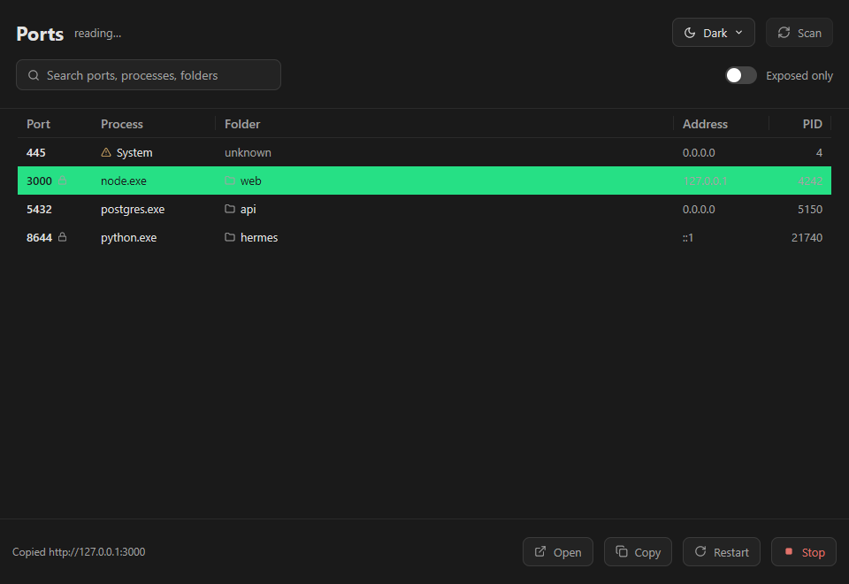

<p align="center">
  
</p>

<h1 align="center">Ports</h1>

<p align="center">
  See what is listening on your machine, and which project it belongs to.
</p>

---

A native Windows app that lists every listening TCP port with the process that owns it, the PID, and **the folder it was started in**. That last one is the point: `netstat` tells you a port is taken, this tells you *which project* took it.

It is built with [MyGo](https://github.com/egoist/mygo) - pure Go, no cgo, no webview, drawn on the GPU. One 11 MB binary that opens instantly.

```
 8644   python.exe     hermes          ::          21740
 34123  waku-daemon    waku            0.0.0.0     17152
 52481  opencode.exe   waku            127.0.0.1   26464
 51467  opencode.exe   portfolio       127.0.0.1   32920
 63502  ABDownload...  system32        127.0.0.1   2392
```

## What it does

- **Lists every listening TCP port**, IPv4 and IPv6, with its process and PID.
- **Shows the working directory** of each process, so two servers of the same program are told apart by the project they serve.
- **Search** across port, process, address and folder.
- **Sort** by any column, and resize or reorder the columns.
- **Exposed only** filters to the ports another machine could reach, which is the question "did I just expose a dev server?".
- **Open** a port in the browser, or **copy** its address.
- **Stop** or **restart** a process, after a confirmation that names it. A restart reuses the original command line and working directory.
- **Rescans every two seconds**, off the UI thread, so the list stays current without a refresh key.
- **Closes to the tray**, and keeps scanning there.
- **Light, dark, or the desktop's own appearance**, from a menu on the button.

## Screenshots

| Light | Dark |
|---|---|
|  |  |

## Install

Download the installer from [Releases](../../releases) and run it. It installs per user to `%LOCALAPPDATA%\Programs\ports` with no administrator prompt, and adds a Start Menu entry. Uninstall from Settings, Apps.

## Build

Needs [Go](https://go.dev/dl/) 1.27 or later. No other toolchain, no Node, no webview runtime.

```sh
go tool mygo build      # ports.exe and the installer, in build/windows-amd64
go tool mygo dev        # run with live reload
go test ./...           # the tests
```

## How it works

Two things are worth knowing, because they are not the obvious approach.

**The port table comes from `GetExtendedTcpTable`, not from `netstat`.** `netstat`'s output is localized, so its columns and address text differ per system language. The API is not.

**The working directory comes from the process's PEB.** Windows exposes a process's current directory and command line only through `NtQueryInformationProcess` - neither the toolhelp snapshot nor WMI reports them. `process_windows.go` reads `RTL_USER_PROCESS_PARAMETERS` at the documented offsets. Everything there is read-only.

Reading the command line *before* stopping a process is what makes restart work: the command line is gone with the process, so reading it afterwards silently loses the arguments.

## Safety

- Every destructive action asks first, and names the process it will affect.
- System processes (PID 4 and below) cannot be stopped, and their buttons say so.
- A process this user may not end reports why, rather than failing quietly.
- Nothing is written outside the app's own settings file and the window's remembered position.

## Layout

```
port.go                      what a port is, and its address
scan.go                      the scan, filtering and sorting
scan_windows.go              the TCP tables, from iphlpapi
process_windows.go           the PEB: working directory and command line
process_control_windows.go   stopping and restarting
proc_windows.go              process names, from a toolhelp snapshot
cmdline.go                   splitting a Windows command line
palette.go theme.go          the colour system
app.go actions.go            state, and what the buttons do
view_*.go                    the window: header, table, footer
tray.go trayicon.go          the notification area icon
```

## Licence

MIT
